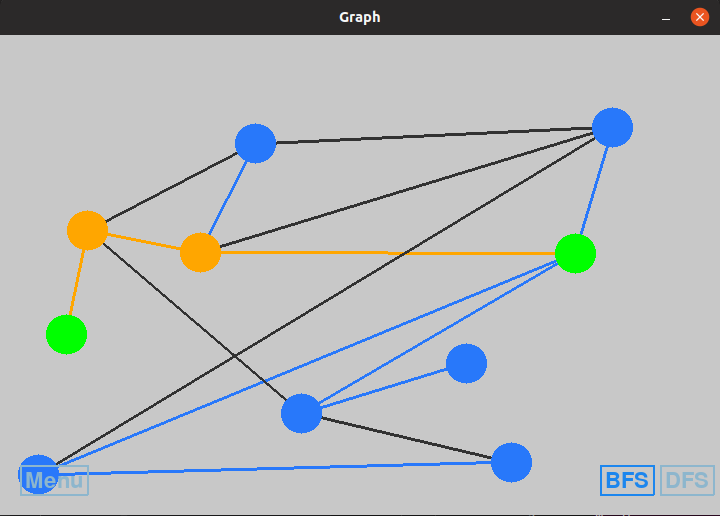

# Simulação de Buscas BFS e DFS

nome | matrícula
-----|----------
Lucas Maciel Aguiar | 17/0070735

## Dependências

Para utilizar este programa, deve-se instalar as dependências:

    sudo apt-get update
    sudo apt-get install python-pip
    pip install -r requirements.txt

## Utilização

Para iniciar o programa:

    python main.py

### Comandos possíveis

* No menu pode-se escolher a quantidade de vértices e arestas do grafo, que será gerado automaticamente;
* Quando o grafo é iniciado, pode-se escolhero método de busca ou voltar ao menu para refazer o grafo;
* É possível alterar as posições dos vértices para melhor visualização, clicando no vértice com o botão esquerdo do mouse e arrastando;
* Também é possível mover todo o grafo quando precisar de mais espaço, para organizar os vértices. Basta apenas pressionar o botão direito do mouse em qualquer posição e arrastar.

### Tela do Programa

